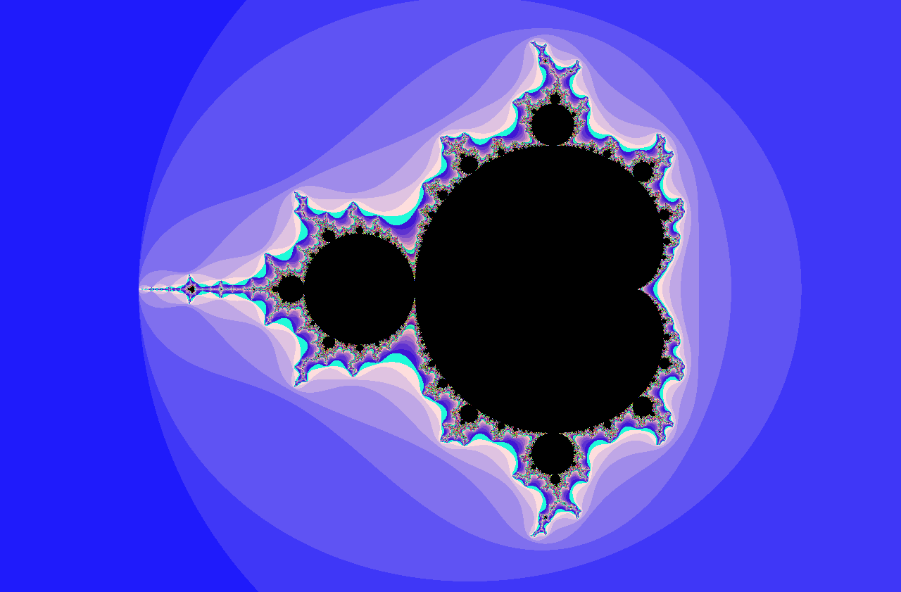

# FRACTOL

This project consists to create a small fractal exploration software.
[What is a Fractal ?](https://en.wikipedia.org/wiki/Fractal)

### Installing

Clone the project

```
git clone https://github.com/BABAK0T0/FRACTOL
```

Then execute Makefile to create an executable

```
make re
```

### Running

Choose a fractal :
* mandelbrot
* julia
* tricorn
* burn
* chameleon
* sword
* all


```
./fractol [name_fractal]
```

### Events

KEYS | DESCRIPTION
:-- |:-:| --:
<kbd>ESC</kbd> | Exit the program
<kbd>ARROWS</kbd> | Move map(x,y)
<kbd>1/2/3</kbd> | Movement speed
<kbd>4/5/6</kbd> | Color
<kbd>I/J</kbd> | Iteration
<kbd>+</kbd> | Zoom +
<kbd>-</kbd> | Zoom -
<kbd>Space</kbd> | Only available for Julia
<kbd>Mouse</kbd> | DeepZoom/Hover after pressed space on Julia
<kbd>R</kbd> | Reset

### Example



### Deployment

Develop for UNIX systems

### Built With

* [Minilibx] - The framework for graphical user interface development

